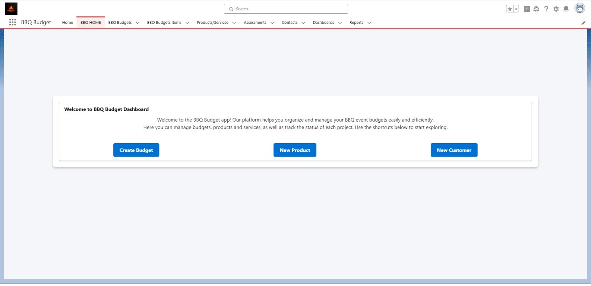
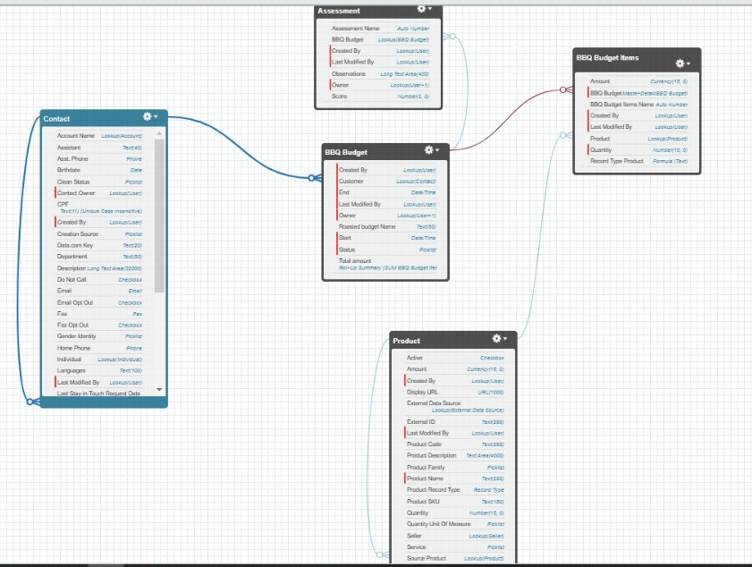
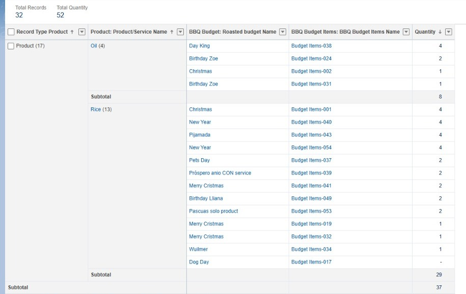
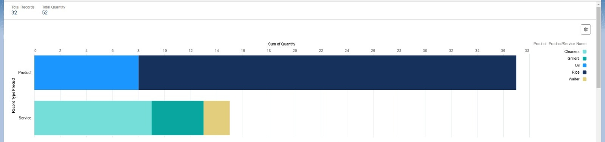
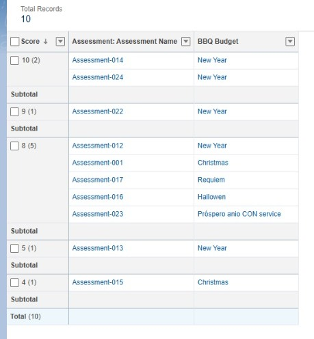
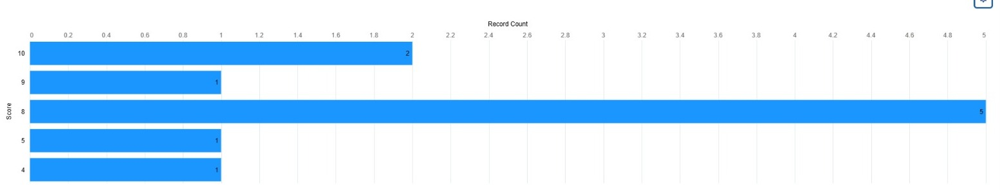
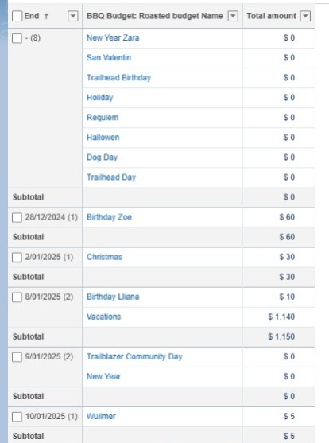

# Presupuesto Asados


## Descripción General

Este proyecto es una aplicación desarrollada en Salesforce para la gestión de presupuestos de asados. Permite a los usuarios crear y gestionar presupuestos, calificar eventos, y realizar un seguimiento de los productos y servicios utilizados. La aplicación está diseñada para ser intuitiva, eficiente y personalizable, aprovechando las capacidades nativas de Salesforce como Flows, LWC (Lightning Web Components) y Apex.

## Características

- Gestión de presupuestos de asados.
- Registro y consulta de productos y servicios asociados.
- Flujo de aprobación de presupuestos.
- Generación de reportes y dashboards para análisis.
- Evaluación de eventos con sistema de calificación.
- Notificaciones automáticas mediante correos electrónicos.

## Estructura de Objetos y Relaciones

La aplicación utiliza los siguientes objetos y relaciones:

### **1. Objeto Principal: BBQ_Budget__c**
- **Nombre:** Roasted Budget Name (Texto)
- **Estado:** Status__c (Picklist)
  - Valores: New, In Process, Approved, Completed
- **Inicio y Fin:** Start__c, End__c (Fecha/Hora)
- **Monto Total:** Total_Amount__c (Currency)
- **Relaciones:**
  - Relación con `BBQ_Budget_Items__c` (Master-Detail)
  - Relación con Contactos (Lookup)

### **2. Objeto Secundario: BBQ_Budget_Items__c**
- **Producto o Servicio:** Product__c (Lookup a Product2)
- **Cantidad:** Quantity__c (Número)
- **Monto:** Amount__c (Fórmula: Cantidad * Precio Unitario)
- **Relaciones:**
  - Relación con `BBQ_Budget__c` (Master-Detail)

### **3. Objeto: Assessment__c**
- **Calificación:** Score__c (Número: 0-10)
- **Observaciones:** Observations__c (Texto Largo)
- **Relaciones:**
  - Relación con `BBQ_Budget__c` (Lookup)

### **4. Producto/Servicio: Product2**
- **Tipo de Registro:** Producto o Servicio
- **Precio Unitario:** UnitPrice (Currency)

### Diagrama de Relaciones


## Requerimientos

Para ejecutar este proyecto, necesitas:

- Una organización Salesforce activa.
- Perfil de administrador en Salesforce.
- Habilitación de Flows, Apex y LWC en tu organización.
- Herramientas CLI de Salesforce.

## Instalación

1. Clona este repositorio:
```bash
git clone https://github.com/MilenaPacheco/Presupuesto-Asados.git
```

2. Accede al directorio:
```bash
cd Presupuesto-Asados
```

3. Autoriza una organización en Salesforce:
```bash
sfdx auth:web:login -a nombreDeTuOrg
```

4. Despliega los metadatos:
```bash
sfdx force:source:deploy -p force-app
```

5. Asigna el paquete al perfil de usuario:
```bash
sfdx force:user:permset:assign -n PresupuestoAsadosPermiso
```

6. Importa datos de ejemplo (opcional):
```bash
sfdx force:data:tree:import -f data/sample-data.json
```

## Flujos Implementados

1. **Flujo de Aprobación de Presupuestos:**
   - Ruta: `Tiene Productos o Servicios -> Aprobación o Actualización -> Notificación`

2. **Notificación por Correo:**
   - Envia correos automáticos a los clientes para informarles del estado del presupuesto.

## Reglas de Validación Implementadas

1. **Validación de Puntaje en Evaluaciones:**
   - **Regla:** Score__c >= 0 && Score__c <= 10
   - **Descripción:** Asegura que el puntaje asignado esté entre 0 y 10.
   
2. **Estado del Presupuesto:**
   - **Regla:** ISCHANGED(Status__c) && Status__c = "Completed"
   - **Descripción:** Permite cambiar el estado a "Completed" solo si se cumplen ciertas condiciones (configurables).

3. **Evitar Productos Duplicados:**
   - **Regla:** NOT(ISBLANK(Product__c)) && Product__c = "[ID Producto Existente]"
   - **Descripción:** Evita duplicar productos en una misma partida presupuestaria.

4. **Campos Obligatorios en Creación de Presupuesto:**
   - **Regla:** ISBLANK(Start__c) || ISBLANK(End__c) || ISBLANK(Client__c)
   - **Descripción:** Asegura que los campos clave estén llenos al crear un presupuesto.

## Dashboards y Reportes

- **Reporte de Productos más Vendidos:**
  - Descripción: Muestra los productos más solicitados agrupados por tipo.
  - 
  - 

- **Reporte de Calificaciones Promedio:**
  - Descripción: Permite analizar las calificaciones asignadas a los eventos.
  - 
  - 

- **Dashboard de Eventos por Día:**
  - Descripción: Visualiza los eventos programados por fecha y el monto asociado.
  - 
  - 

## Flujo de Pantallas

La aplicación BBQ Budget está diseñada con una navegación clara y eficiente que guía al usuario a través de las principales funcionalidades:

1. **Dashboard Principal**
   - Vista general del sistema con botones de acceso rápido para crear presupuestos, productos y clientes.
   - **Imagen:**  


2. **Creación de Presupuesto**
   - Formulario para ingresar información clave del presupuesto, como cliente, fechas y artículos.
   - **Validaciones:**  
     - No se permite guardar sin cliente o fechas.
     - Solo productos activos pueden ser seleccionados.

3. **Evaluación de Eventos**
   - Pantalla para calificar el asado una vez completado.
   - **Restricciones:**  
     - Solo aparece cuando el presupuesto está en estado "Completado".

4. **Dashboards y Reportes**
   - Reportes dinámicos para analizar métricas clave, como productos más vendidos, ingresos diarios y evaluaciones promedio.

#### **Diagrama del Flujo**
```plaintext
[Dashboard Principal] --> [Crear Presupuesto] --> [Agregar Ítems]
      |                              |
      v                              v
[Evaluar Evento]               [Flujo de Aprobación]
```

## Procesos

1. **Desarrollar el Componente de Evaluación del Asado (LWC):**
   - Crear un Lightning Web Component que permita puntuar y agregar observaciones para los presupuestos de asado.
   - El componente solo aparecerá cuando el estado del presupuesto sea "Completado".
   - Configurar para guardar un registro en el objeto Evaluación.

2. **Automatizar el Proceso de Cancelación de Presupuestos No Realizados:**
   - Implementar un Apex Scheduler/Batch que cancele automáticamente los presupuestos no realizados después de su fecha prevista.

3. **Configurar Flujos de Pantalla de Aprobación para Presupuestos:**
   - Crear un flujo para presupuestos que contengan artículos de servicio, enviándolos para aprobación.
   - Para presupuestos sin artículos de servicio, configurar una actualización automática del estado a "Programado".

4. **Completar Automáticamente el Campo Valor en Presupuesto:**
   - Crear un custom metadata para la tabla de precios de servicios (con parrillero, limpieza y mesero, incluyendo sus valores por hora).
   - Desarrollar un Apex Trigger para calcular automáticamente el valor de los artículos según:
     - Tipo de producto o servicio.
     - Cantidad, duración del evento, y la tabla de precios.

5. **Validar Artículos Duplicados:**
   - Implementar un Apex Trigger que valide si ya existe un artículo con el mismo producto en el presupuesto de asado.
   - Mostrar un mensaje de error en caso de duplicados.

6. **Optimizar las Vistas de Lista:**
   - Agregar campos adicionales necesarios, como cliente, propietario, estado, valor total, y cantidad de productos/servicios, según lo discutido.
   - Configurar filtros adecuados para destacar presupuestos recientes o específicos.

7. **Elaborar Informes y Tableros de Control:**
   - Crear reportes clave para analizar los KPI del proyecto, como presupuestos aprobados, ingresos totales, productos más utilizados, etc.
   - Configurar un dashboard Lightning para visualización centralizada de datos.

8. **Asegurar la Cobertura de Pruebas:**
   - Crear clases de prueba en Apex para cubrir al menos el 75% de todas las funcionalidades desarrolladas.
   - Incluir casos de prueba para el Trigger, Batch, y flujos.

9. **Validar Reglas Empresariales:**
   - Revisar que las reglas empresariales definidas, como evitar presupuestos sin CPF o productos no activos, estén correctamente implementadas y funcionando.

10. **Mejorar Diseño de Páginas Lightning:**
   - Reorganizar componentes en las páginas Lightning para que sean más intuitivas y agradables visualmente.
   - Aplicar bordes, centrado y estilos visuales según las necesidades.

## Uso

### Creación de un Presupuesto
1. Dirígete a la pestaña `Presupuesto Asados`.
2. Haz clic en `Nuevo Presupuesto`.
3. Llena los campos requeridos y guarda el registro.

### Evaluación de un Evento
1. Accede a un presupuesto completado.
2. Califica el evento usando el componente de evaluación.
3. Guarda la evaluación.

### Visualización de Reportes
1. Accede a la pestaña `Reportes`.
2. Selecciona el reporte deseado.
3. Filtra los resultados según tus necesidades.

## Contribución

1. Realiza un fork de este repositorio.
2. Crea una rama para tu feature:
```bash
git checkout -b feature/nueva-feature
```
3. Realiza los cambios y haz un commit:
```bash
git commit -m "Agrega nueva funcionalidad"
```
4. Envía tus cambios:
```bash
git push origin feature/nueva-feature
```
5. Crea un Pull Request.
